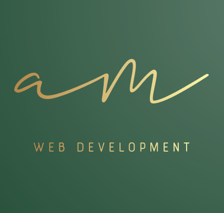

#  Tidy Budget App

  
   
  <h3><b>TIDY BUDGET</b></h3>

<!-- TABLE OF CONTENTS -->

# 📗 Table of Contents

- [📖 About the Project](#about-project)
  - [🛠 Built With](#built-with)
    - [Tech Stack](#tech-stack)
    - [Key Features](#key-features)
  - [:movie_camera: Project Presentation](#project-presentation)
  - [🚀 Live Demo](#live-demo)
- [💻 Getting Started](#getting-started)
  - [Prerequisites](#prerequisites)
  - [Setup](#setup)
  - [Clone](#clone)
  - [Usage](#usage)
- [👥 Authors](#authors)
- [🤝 Contributing](#contributing)
- [⭐️ Show your support](#support)
- [⭐️ Future Features](#future-features)
- [🙏 Acknowledgements](#acknowledgements)
- [📝 License](#license)

<!-- PROJECT DESCRIPTION -->

# 📖 Tidy Budget 

**Tidy Budget App** The Tidy Budget app is a mobile web application where you can manage your budget, you have a list of transactions associated with a category so that you can see how much money you spent and on what.

## 🛠 Built With 

### Tech Stack 

  
Languages &  bundlers

  <ul>
    <li><a href="https://www.ruby-lang.org/">Ruby</a></li>
    <li><a href="https://rubyonrails.org/">Ruby on Rails</a></li>
    <li><a href="https://rspec.info/">RSpec</a></li>
  </ul>

Database

  <ul>
    <li><a href="https://www.postgresql.org/">PostgreSQL</a></li>
  </ul>

<!-- Features -->

### Key Features 
a Ruby on Rails application that allows the user to:

- Register and log in, so that the data is private to them.
- Introduce new transactions associated with a category.
- See the money spent on each category.

(<a href="#readme-top">back to top</a>)

<!-- Project Presntation -->

## :movie_camera: Project Presentation 

Walking through portfolio outline.

- [Project Presentation Link](https://www.loom.com/share/c76dabbdb7e640e7b81b7f32079f5eb4?sid=46eecc2f-d356-4502-893a-e3a838bfbefd)

(<a href="#readme-top">back to top</a>)

<!-- LIVE DEMO -->

## 🚀 Live Demo 

- [Live Demo Link](https://tidybudget.onrender.com/)

(<a href="#readme-top">back to top</a>)

<!-- GETTING STARTED -->

## 💻 Getting Started 

To get a local copy up and running, follow these steps.

### Prerequisites

In order to run this project you need:

Download and Install the latest Ruby distributions.
[Download Ruby](https://www.ruby-lang.org/en/downloads/)

### Setup

- *Docs*
[Installation Documentation](https://www.ruby-lang.org/en/documentation/installation/)

### Clone

- Clone this repo to your local machine using `https://github.com/Abdelaziz-Mahdi/blog-app.git`

### Usage
Run the following commands on your terminal:
- bundle install
- rails s

(<a href="#readme-top">back to top</a>)

<!-- AUTHORS -->

## 👥 Authors 

👨🏼‍🚀 **Abdelaziz Mahdi** 🐱‍👤

- GitHub: [@Abdelaziz-Mahdi](https://github.com/Abdelaziz-Mahdi)
- Twitter: [@_AbdelazizMahdi](https://twitter.com/_AbdelazizMahdi)
- LinkedIn: [in/abdelaziz-mahdi](https://www.linkedin.com/in/abdelaziz-mahdi)

(<a href="#readme-top">back to top</a>)

<!-- CONTRIBUTING -->

## 🤝 Contributing 

Contributions, issues, and feature requests are welcome!

Feel free to check the [issues page](https://github.com/Abdelaziz-Mahdi/tidy-budget/issues).

(<a href="#readme-top">back to top</a>)

## ⭐️ Show your support 

Give a ⭐️ if you like this project!

(<a href="#readme-top">back to top</a>)

## ⭐️ Future Feature 

- Design
- [x] Design guidelines >> (Snapscan)[https://www.behance.net/gallery/19759151/Snapscan-iOs-design-and-branding?tracking_source=], including:
    - Colors.
    - Typography: font face, size and weight.
    - Layout: composition and space between elements.

- Interactions
- [x] Splash screen
- [x] Sign up and log in pages
- [x] Home page (categories page)
- [x] Transactions page
- [x] "Add a new category" page
- [x] "Add a new transaction" page

- Testing
- [x] Create unit and integration tests for all the most important components of the application.

- Technical
- [x] Use Postgres as database.
- [x] Use devise for authentication.
- [x] Validate all user input to make sure that anyone with bad intentions cannot compromise the app.
- [x] App deployed and accessible online.

(<a href="#readme-top">back to top</a>)

## 🙏 Acknowledgments 

- Project inspired by Microverse Program.
- Design - Original design idea by (Gregoire Vella on Behance)[https://www.behance.net/gregoirevella].

(<a href="#readme-top">back to top</a>)

## 📝 License 

This project is [MIT](./LICENSE) licensed.

(<a href="#readme-top">back to top</a>)

